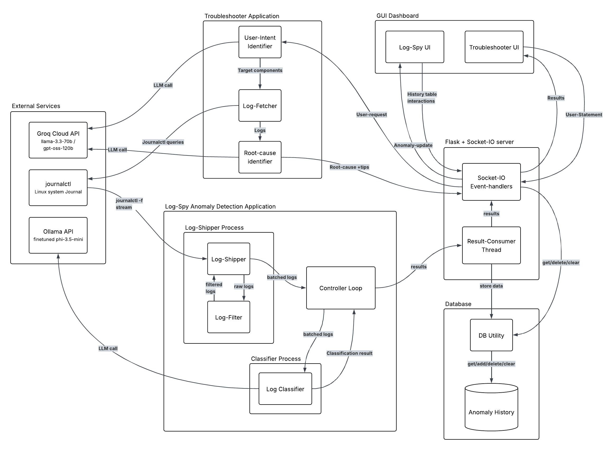

# LogSpy

**Real-time Linux log anomaly detection and intelligent troubleshooting**

LogSpy is a desktop application that continuously monitors your Linux system journal (`journalctl`), detects anomalies using a fine-tuned local LLM, and provides an AI-powered troubleshooter that can diagnose problems by analyzing relevant logs with cloud LLMs.

---

## Features

- **Real-Time Anomaly Detection** — Streams logs from `journalctl`, filters noise, and classifies batches using a fine-tuned Phi-3.5-mini model running locally via Ollama.
- **Intelligent Log Filtering** — Removes noisy, routine, and informational logs (GNOME, PipeWire, WiFi signal spam, etc.) so only meaningful entries reach the classifier.
- **AI-Powered Troubleshooter** — Describe a problem in plain English and LogSpy will identify relevant components, fetch their logs, and perform root-cause analysis using Groq Cloud LLMs (Llama 3.3 70B & GPT-OSS-120B).
- **Anomaly History** — All detected anomalies are persisted in a local SQLite database with full CRUD support.
- **Native Desktop GUI** — Runs as a native window via `pywebview` with a Flask + Socket.IO backend for real-time updates.
- **Two-Panel Dashboard** — Separate UIs for live anomaly monitoring (Log-Spy) and interactive troubleshooting.

---

## Architecture



The application is composed of several subsystems communicating via multiprocessing queues and Socket.IO events:

| Subsystem | Description |
|---|---|
| **Log-Shipper Process** | Streams `journalctl -f` output, filters noise via `LogFilter`, buffers logs, and sends batches to the Controller Loop. |
| **Controller Loop** | Orchestrates data flow — receives batches from the shipper, forwards them to the classifier, and relays results to the app. |
| **Classifier Process** | Calls a fine-tuned Phi-3.5-mini model via Ollama to classify log batches as anomalous or normal. |
| **Troubleshooter** | A 3-step LLM pipeline: (1) Intent identification → (2) Targeted log fetching → (3) Root-cause analysis. Uses Groq Cloud APIs. |
| **Flask + Socket.IO Server** | Serves the GUI, handles real-time event communication, and bridges the backend processes with the frontend. |
| **Database** | SQLite-backed anomaly history with add, get, delete, and clear operations. |
| **GUI Dashboard** | Two HTML/CSS/JS frontends — Log-Spy UI for monitoring and Troubleshooter UI for diagnosis. |

---

## Project Structure

```
LogSpy/
├── app.py                          # Entry point — Flask server, Socket.IO, pywebview
├── requirements.txt                # Python dependencies
│
├── log_spy/                        # Anomaly detection engine
│   ├── main.py                     # Controller loop (multiprocessing orchestrator)
│   ├── log_shipper.py              # Journalctl streaming + buffering
│   ├── log_filter.py               # Noise filtering + log preprocessing
│   ├── log_classifier.py           # Ollama LLM-based anomaly classification
│   └── db_ops.py                   # SQLite database operations
│
├── troubleshooter/                 # AI troubleshooting module
│   ├── troubleShooter.py           # Intent identification + root-cause analysis
│   ├── log_fetcher.py              # Targeted log fetching via journalctl
│   ├── intent_sys_prompt.txt       # System prompt for intent identification
│   ├── rc_sys_prompt.txt           # System prompt for root-cause analysis
│   └── .env                        # Groq API keys
│
├── templates/                      # Jinja2 HTML templates
│   ├── log_spy.html                # Log-Spy dashboard
│   └── troubleshooter.html         # Troubleshooter interface
│
└── static/                         # Frontend assets
    ├── common/                     # Shared styles
    ├── log_spy/                    # Log-Spy JS + CSS
    └── troubleshooter/             # Troubleshooter JS + CSS
```

---

## Prerequisites

- **Linux** with `journalctl` available (systemd-based distro).
- **Python 3.10+**
- **[Ollama](https://ollama.com/)** installed and running, with a fine-tuned Phi-3.5-mini model loaded as `finetuned_phi_3.5:latest`.
- **Groq Cloud API keys** (for the Troubleshooter module) — set `GROQ_API_KEY_1` and `GROQ_API_KEY_2` in `troubleshooter/.env`.

---

## Getting Started

### 1. Clone the Repository

```bash
git clone https://github.com/aadilsalimm/LogSpy.git
cd LogSpy
```

### 2. Create a Virtual Environment

```bash
python -m venv .venv
source .venv/bin/activate
```

### 3. Install Dependencies

```bash
pip install -r requirements.txt
```

### 4. Configure Environment Variables

Create or edit `troubleshooter/.env`:

```env
GROQ_API_KEY_1=your_groq_api_key_here
GROQ_API_KEY_2=your_groq_api_key_here
```

### 5. Set Up Ollama

Make sure Ollama is installed and the fine-tuned model is available:

```bash
ollama list  # Verify 'finetuned_phi_3.5:latest' is listed
```

### 6. Run the Application

```bash
python app.py
```

A native desktop window will open with the Log-Spy dashboard. Use the **Open Troubleshooter App** button to access the troubleshooter.

---

## How It Works

### Anomaly Detection Pipeline

1. **Log Shipping** — `LogShipper` spawns a `journalctl -f -o json` subprocess and reads logs line-by-line.
2. **Filtering** — Each log is checked against identifier blacklists, regex patterns, and priority levels. Only warning-level and above logs (priority ≤ 5) pass through by default.
3. **Batching** — Filtered logs are buffered (default: 5 logs per batch) and sent to the Controller Loop via a multiprocessing queue.
4. **Classification** — The Controller Loop forwards batches to the `LogClassifier`, which prompts a local Phi-3.5-mini model via Ollama's API to determine if the batch indicates anomalous behavior.
5. **Result Handling** — Classification results (anomalous/normal, component, reason, timestamp) are stored in SQLite and pushed to the frontend via Socket.IO.

### Troubleshooter Pipeline

1. **Intent Identification** — The user's problem description is sent to Llama 3.3 70B (via Groq) to identify target system components and generate `journalctl` queries.
2. **Log Fetching** — Relevant logs are fetched from the system journal based on the identified components and timeframe.
3. **Root-Cause Analysis** — Collected logs are sent to GPT-OSS-120B (via Groq) for detailed root-cause analysis and actionable recommendations.

---
<!-- 
## License

This project is open source. See the repository for license details. -->
